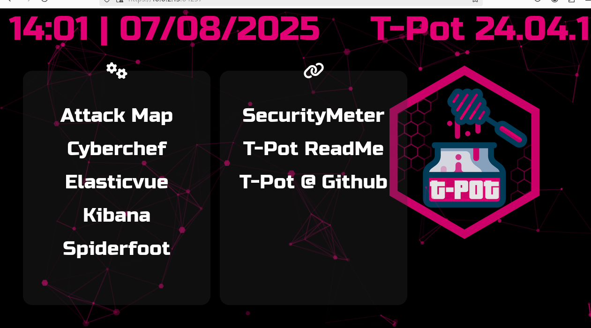

# Project: T-Pot Honeypot Deployment & Threat Intelligence Platform

## Overview
This project demonstrates the deployment of T-Pot, a multi-honeypot platform for threat intelligence and network security monitoring. The implementation includes Docker containerization, honeypot configuration, and integration with security analysis tools for comprehensive threat detection and analysis.

---

## Organizational Application

### Importance to Companies
This honeypot deployment is vital for organizations to proactively detect and analyze emerging cyber threats, providing early warning of attack patterns targeting their industry. It transforms the organization from reactive defense to proactive threat intelligence gathering.

### Use Case Scenario
A financial institution deploys T-Pot to detect reconnaissance activity and emerging attack vectors targeting banking systems, allowing them to strengthen defenses against specific threats before they impact production environments.

---

## Configuration & Screenshots

### 1. Docker Installation Script Preparation
- Created automated Docker installation script
- Configured proper permissions for execution
- Prepared environment for container deployment


*Docker installation script preparation with execution permissions*

### 2. Docker Installation Execution
- Executed automated Docker installation process
- Verified successful Docker engine deployment
- Prepared system for container orchestration


*Docker installation process execution and verification*

### 3. T-Pot Repository Cloning
- Cloned T-Pot Community Edition repository from GitHub
- Downloaded complete honeypot framework
- Prepared for deployment configuration


*T-Pot CE repository cloning process*

### 4. T-Pot Installation Script Execution
- Executed T-Pot installation script
- Configured multi-honeypot environment
- Deployed containerized security monitoring platform


*T-Pot installation script execution*

### 5. T-Pot Deployment Configuration
- Configured sensor deployment parameters
- Set up remote logging and data transmission
- Prepared honeypot network architecture


*T-Pot sensor deployment configuration*

### 6. T-Pot Dashboard Overview
- Accessed T-Pot main security dashboard
- Monitored real-time threat intelligence
- Viewed security metrics and attack statistics


*T-Pot main security dashboard with threat metrics*

### 7. ElasticVue Elasticsearch Interface
- Configured Elasticsearch cluster management
- Prepared log analysis and data visualization
- Set up search and query capabilities


*ElasticVue Elasticsearch management interface*

### 8. SpiderFoot Threat Intelligence
- Accessed SpiderFoot security scanning platform
- Configured threat intelligence gathering
- Prepared for network reconnaissance analysis


*SpiderFoot threat intelligence platform*

### 9. Real-time T-Pot Attack Map Monitoring
- Monitored live attack data and honeypot interactions
- Tracked threat actor activities and patterns
- Analyzed real-time security events


*Live attack monitoring and threat detection*

### 10. Security Scan Management sicherheitstacho
- Configured vulnerability scanning capabilities
- Set up automated security assessment
- Prepared for comprehensive network analysis


*Security scan configuration and management*

---

## Observations and Challenges

### Technical Challenges
- **Docker Dependency Management**: Required precise container orchestration configuration
- **Network Configuration**: Complex networking setup for honeypot isolation
- **Resource Allocation**: Significant system resources required for multiple honeypots

### Security Implementation
- **Honeypot Diversity**: Multiple honeypot types deployed for comprehensive coverage
- **Data Collection**: Extensive logging and monitoring capabilities implemented
- **Threat Intelligence**: Real-time data aggregation and analysis configured

### Performance Considerations
- **System Requirements**: High resource demands for full deployment
- **Network Bandwidth**: Significant data transmission for threat intelligence
- **Storage Capacity**: Extensive log storage requirements

---

## Reflections

### Technical Insights
- **Containerization Benefits**: Docker provided isolated, scalable honeypot deployment
- **Threat Visibility**: Comprehensive attack surface monitoring achieved
- **Integration Complexity**: Multiple tool integration required careful configuration

### Security Implications
- **Attack Pattern Analysis**: Valuable insights into threat actor methodologies
- **Early Warning Capability**: Enhanced network threat detection
- **Security Posture Improvement**: Proactive defense mechanism implementation

### Operational Lessons
- **Automation Value**: Scripted deployment ensured consistency and reliability
- **Monitoring Importance**: Continuous security monitoring essential for threat detection
- **Documentation Criticality**: Comprehensive documentation required for complex deployments

---

## How to Reproduce

### Prerequisites
- Ubuntu Server 24.04 LTS
- Minimum 8GB RAM, 100GB storage
- Network connectivity with external access
- sudo privileges for installation

### Implementation Steps

1. **System Preparation**
```bash
sudo apt update
sudo apt upgrade -y
```

2. **Docker Installation**
```bash
nano install-docker.sh
chmod +x install-docker.sh
./install-docker.sh
```

3. **T-Pot Deployment**
```bash
git clone https://github.com/telekom-security/tpotce.git
cd tpotce
./.install.sh
```

4. **Configuration Setup**
```bash
./deploy.sh
# Follow interactive prompts for sensor configuration
```

5. **Service Verification**
```bash
sudo docker ps
sudo systemctl status tpot
```

6. **Dashboard Access**
```bash
# Access web interfaces
http://localhost:64294  # T-Pot Dashboard
http://localhost:64297  # ElasticVue
http://localhost:64299  # SpiderFoot
```

7. **Monitoring Configuration**
```bash
# Configure alerting and notifications
nano /opt/tpot/etc/tpot.yml
```

8. **Data Analysis Setup**
```bash
# Configure log retention and analysis
nano /opt/tpot/etc/elasticsearch/elasticsearch.yml
```
